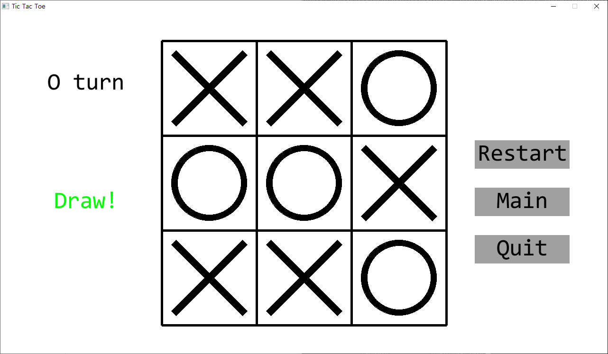
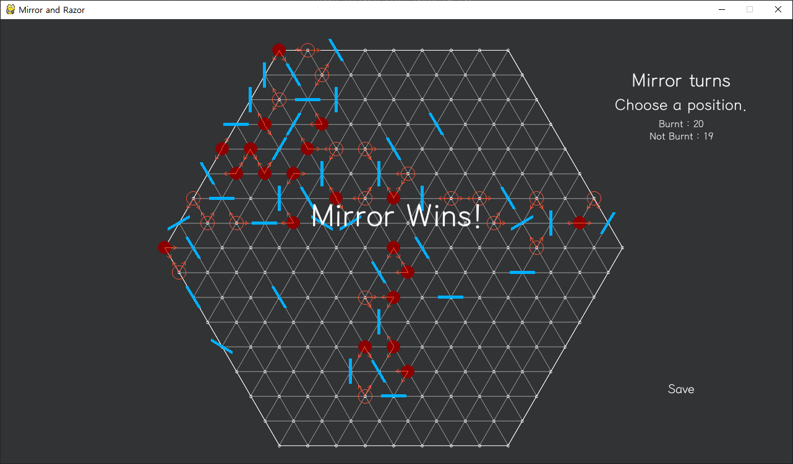

# 추상전략 게임들을 구현합니다!

python의 pygame을 이용하여 추상전략 게임을 구현해봅니다.

추상전략 게임이란 보드 게임에서 숨겨지거나 운적인 요소가 없고 나와 상대방의 패가 모두 공개된 게임을 말합니다. 수가 유한하기 때문에 서로 최선의 수를 두었을 때 항상 한 쪽이 무조건 이기거나 무조건 비길 수 밖에 없습니다. 그래도 무궁무진한 수를 가지고 있기 때문에 수를 다 외우지 않은 이상 충분히 즐길 수 있는 게임입니다.

게임 모두 pygame을 사용하기 때문에 py파일을 바로 열 수 없고, 실행하는 파이썬 인터프리터가 pygame을 지원해야 사용할 수 있습니다. 일반적으로는 파이썬3을 설치하였을 때 cmd창을 열고 다음과 같은 명령어
```
pip3 install pygame
```
를 입력하면 사용할 수 있을 겁니다. 자세한 것은 파이게임 설치하는 법에 대해서 알아보세요.

추상전략게임에 사용된 폰트('myfont.ttf')는 ba안경고딕입니다.






---
## 만들 순서

1. 체스
2. 틱택도
3. 거울과 레이저
4. 오목
5. 오델로

### 조사된 추상전략 게임 시리즈
* 오목
* 오델로
* 쿼리도 (Quoridor)
* 퀵소 (Quxio)
* 콰르토
* 고누
* 체스
* 틱택토
* 바둑
* 장기
* 체커

### 직접 만든 추상전략 게임
* 거울과 레이저
<br>
---

### 추상전략 게임 크리에이터
* 김도훈 (yh08037)
* 윤대헌 (Greathoney)

### 사용환경
Python 3.7.0 ~ 3.7.2

Pygame 1.9.4
